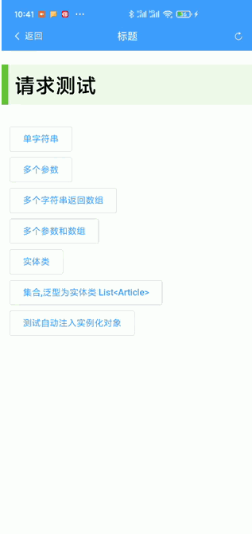

# android-vue

copy [https://gitee.com/jpw_code/android-vue](https://gitee.com/jpw_code/android-vue)

#### 效果图


#### 介绍
用vue来创建界面，使用webview承载页面，通过反射实现请求数据


#### 软件架构
软件架构说明，使用android webview 承载vue页面，在vue页面请求通过webView调用js方法，通过反射执行请求，并返回结果。


#### 安装教程

1.  复制或下载项目
2.  使用android studio打开项目
3.  使用命令行运行vue项目项目
4.  修改使用参数查看结果
5.  修改配置参数打包vue项目打包成apk

#### 使用说明

1.  下载项目
2.  打开项目的vue目录，使用命令执行行` npm i` 命令初始化vue项目
3.  在android stuido 中打开项目
4.  在`com.orange.ldv.Config`类中修改配置参数
5.	当使用运行调试时，将`APK=false`;当打包时反之（`注`打包前请先使用`npm run build`打包vue项目，之后在打包`APK`） 
6.	在修改`APK`之后修改`getWebIndexUrl()`方法中的返回值，根据实际情况进行修改。如果使用手机调试请修改成`http://ip地址:端口号`，如果使用androi stuido 自带模拟器则需要修改成对应的ip(`10.0.2.2`根据实际情况修改)；
7.	显示标题栏和显示状态栏，通过`showTitle`和`showStatusBar`进行控制
8.	如果修改整改项目的包名称，则一定需要修改`basePackages`参数

#### 整个项目包结构
```
|-app
	|--main
	|--assets //存放web页面
		|--ui  //存放vue项目生成文件。在vue目录使用`npm run build`会自动复制到当前目录
	|--java
		|--com.orange.ldv  //项目包
			|--annotation 	//反射所需要的注解类
			|--controller	 //（包名不可更改）请求控制类
			|--entity     	//实体类
			|--response   	//请求相应类
			|--services   	//服务类
	|--res
	|--vue //vue        //项目开发目录，
```

#### 请求说明
##### 1.请求支持类型 （`更多的类型转换需要你的支持`）
|范围|类型|
|--|--|
|基本类型|`String`,`Boolean`,`Integer`,`Double`,`Float`,`Long`,`Byte`,`Short`,`Character`,`Date`(Date的各种格式支持需要在`Config`类中添加支持，可以将使用频率高的格式配置在数组最开始位置)|
|数组和集合| 数组如`Article []`(实体类数组) ，`String []` 字符串数组等其他类型；集合`List<?>`，`ArrayList<?>`|

##### 2.请求参数说明
> 目前的项目中有请求相关的示例
###### 2.1 测试请求类型
```java
package com.orange.ldv.controller;

import com.orange.ldv.annotation.AppAutowired;
import com.orange.ldv.annotation.AppController;
import com.orange.ldv.annotation.AppRequestMapper;
import com.orange.ldv.annotation.AppRequestMethod;
import com.orange.ldv.entity.Article;
import com.orange.ldv.services.TestServices;

import java.util.Date;
import java.util.List;

@AppController(path = "test")
public class TestController {

		/**
		 * 单字符串
		 */
    @AppRequestMapper(path = "/get6", method = AppRequestMethod.GET)
    public String getTest6(String str) {
        return str;
    }
		
		/**
		 * 多个参数
		 */
    @AppRequestMapper(path = "/get", method = AppRequestMethod.GET)
    public String getTest(String str, int str2) {
        return "这是修改后的字符串" + str + "," + str2;
    }
		
		/**
		 * 多个字符串返回数组
		 */
    @AppRequestMapper(path = "/get2", method = AppRequestMethod.GET)
    public String[] getTest2(String str, int str2) {
        return new String[]{"这是修改后的字符串", str, str2 + ""};
    }

		/**
		 * 多个参数和数组
		 */
    @AppRequestMapper(path = "/get3", method = AppRequestMethod.GET)
    public String[] getTest3(String[] str, int str2) {
        return new String[]{"这是修改后的字符串", "数组长度是:" + str.length, str2 + ""};
    }
		
		/**
		 * 实体类
		 */
    @AppRequestMapper(path = "/get4", method = AppRequestMethod.GET)
    public Article getTest4(Article article) {
        article.setUpdatedTime(new Date());
        return article;
    }

		/**
		 * 集合,泛型为实体类 List<Article>
		 */
    @AppRequestMapper(path = "/get5", method = AppRequestMethod.GET)
    public List<Article> getTest5(List<Article> articles) {
        return articles;
    }

		/**
		 * 自动注入调用时实例化
		 */
    @AppAutowired
    private TestServices testServices;
		
		/**
		 * 测试自动注入实例化对象
		 */
    @AppRequestMapper(path = "/get7", method = AppRequestMethod.GET)
    public String getTest7() {
        return testServices.getString();
    }

}

```
###### 2.2各方法对应的vue请求示例
> 在请求方法中对请求类型和请求参数做了默认值处理,当`method`为假值时，默认请求为GET，当请求参数为`params`假值时,默认做''处理
```javascript
	/**
	 * 单字符串。当有且仅有一个参数时，直接是参数值
	 */			
	let res=this.$ano.requestSync('test/get6','get','张三');
	
	/**
	 * 多个参数
	 */
	let res=this.$ano.requestSync('test/get','get',{str2: '2',str: 'html'});
	
	/**
	 *  多个字符串返回数组
	 */
	let res=this.$ano.requestSync('test/get2','get',{str2: '2',str: 'html'});	
	
	/**
	 *  多个参数和数组
	 */
	let res=this.$ano.requestSync('test/get3','get',{
			str2: '2',
			str: ['html', '张某某']
		});
						
	/**
	 *  实体类
	 */
	let res=this.$ano.requestSync('test/get4','get', {
			content: '这是文章内容',
			id: '123',
			image: 'imagess',
			isDelete: '0',
			createdBy: '1',
			createdTime: new Date(),
			updatedTime: '2014年02月08日',
			title: '这是标题'
		});
         
	 /**
		*  集合,泛型为实体类 List<Article>
		*/
  let res=this.$ano.requestSync('test/get5','get', [{
			content: '这是文章内容1',
			id: '123',
			image: 'imagess1',
			isDelete: '0',
			createdBy: '1',
			createdTime: new Date(),
			updatedTime: '2014年02月08日',
			title: '这是标题'
		}, {
			content: '这是文章内容2',
			id: '123',
			image: 'imagess2',
			isDelete: '1',
			createdBy: '2',
			createdTime: new Date(),
			updatedTime: '2023年02月08日',
			title: '这是标题3'
		}]);
		
	/**
	 *   测试自动注入实例化对象
	 */
	let res=this.$ano.requestSync('test/get7');

```

###### 2.3注解使

* `@AppController` 添加到`controller`包下的`类`上的注解
	+ `path`表示请求路径

```java

package com.orange.ldv.controller;

@AppController(path = "test")
public class TestController {
	
}

```

* `@AppRequestMapper` 添加到`controller`保险类的`方法`上的注解
	+ `path`表示请求路径 ;`method`表示请求方式
	
```java

package com.orange.ldv.controller;

@AppController(path = "test")
public class TestController {

		/**
		 * 单字符串
		 */
		@AppRequestMapper(path = "/get6", method = AppRequestMethod.GET)
		public String getTest6(String str) {
		    return str;
		}
}

```

* `@AppAutowired` 在`controller`包下的申明变量时，有需要`实例化的对象变量`上


 ```java
 
 package com.orange.ldv.controller;
 
 @AppController(path = "test")
 public class TestController {
	 
		 /**
			* 自动注入调用时实例化
			*/
		 @AppAutowired
		 private TestServices testServices;
 
 }
 
 ```


#### 参与贡献


#### 特技
